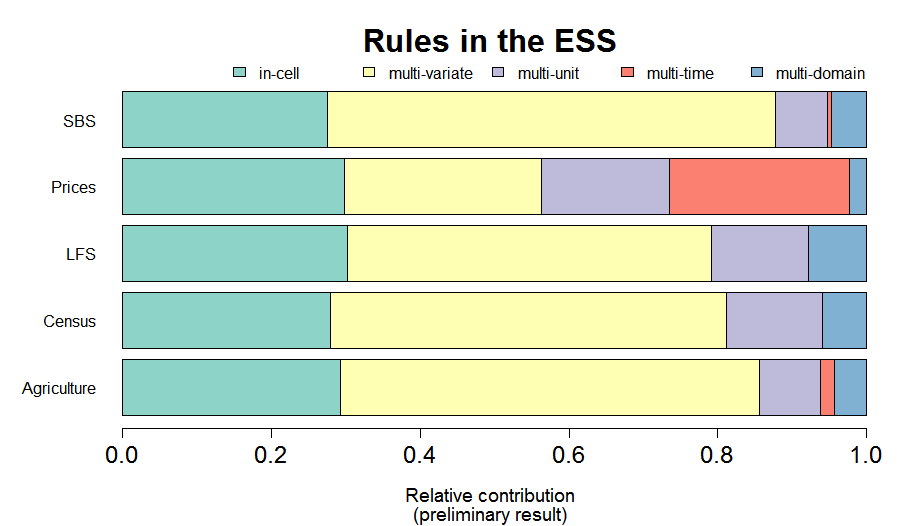

```{r setup, include=FALSE}
knitr::opts_chunk$set(echo = TRUE)
```


## Getting Started

1. Go to https://github.com/markvanderloo/2024uRos
2. Follow the instructions of the README to clone this repository into an RStudio project
3. Open the file `assignments/01_validate.R`


## Goals of this presentation

- Define data validation formally
- Insight into the workings of validate and its syntax

# Data Validation

## Some examples from a survey amongst the ESS member states

- If a respondents has _income from other activities_, fields under _other activities_ must be filled.
- _Yield per area_ must be between 40 and 60 metric tons
- A person of _age_ under 15 cannot _take part in an economic activity_
- The field _type of ownership_ (of a building) may not be empty
- The _regional code_ must be in the code list.
- The _current average price_ divided by _last period's average price_ must lie between 0.9 and 1.1.


## Definition (European Statistical System)

### Definition of data validation

Data Validation is an activity verifying whether or not a combination of values
is a member of a set of acceptable combinations.

\tiny{}\hfill{}[Di Zio _et al_ Methodology of Data Validation (ESS Handbook, 2016)](https://ec.europa.eu/eurostat/documents/7755309/7769541/Methodology_for_data_validation_V1.0_REV-2016-06_FINAL.pdf/ed7abb5d-6f1f-4e92-9a72-40d8a7fe0b85)\normalfont{}

## Formal definition (sort of)

###  

A _data validation function_ is a function that accepts a data set and returns \texttt{True} (valid) or \texttt{False} (invalid)


### Notes

- We skip some fine-print, such as the domain of a data validation function
- There is no real difference between data validation functions and data validation rules:

$$
\textsf{Age}\geq 0 \iff f(\textsf{Age}) = \left\{\begin{array}{l}
\texttt{True}\textsf{ if Age} \geq 0\\
\texttt{False}\textsf{ otherwise}
\end{array}
\right. 
$$

## Examples of validation rules


### Single variable; multiple variables

$Age \geq 0$; $Age<15\Rightarrow Has\_Job = \texttt{no}$

### Multiple entities

$\textsf{mean}(Profit) \geq 10$

### Multiple times or domains

$0.9<\textsf{mean}(Profit_{2018})/\textsf{mean}(Profit_{2017}) <1.1$


## Assessing the complexity of data validaton rules

1. Answer with $s$ or $m$: do we need values from 
  - a $s$ingle, or $m$ultiple entity types (populations) $U$?
  - a $s$ingle, or $m$ultiple measurements $\tau$?
  - a $s$ingle, or $m$ultiple population units $u$?
  - a $s$ingle, or $m$ultiple variables $X$?
2. The _complexity label_ is the 4-tuple of $s$'s and $m$'s
3. The _complexity level_ is the number of $m$'s counted


\tiny{}\hfill{}[MPJ van der Loo, E de Jonge (2020). Data Validation. In Wiley StatsRef: Statistics Reference Online](https://markvanderloo.eu/files/share/loo2020data.pdf) \normalfont{}

## Examples: $U\tau u X$ classification of data validation rules

### Single variable; multiple variables

- $Age \geq 0$: $ssss$, level $0$
- $Age<15\Rightarrow Has\_Job = \texttt{no}$: $ssssm$, level 1

### Multiple entities

- $\textsf{mean}(Profit) \geq 10$ $ssms$, level 1

### Multiple times or domains

- $0.9<\textsf{mean}(Profit_{2018})/\textsf{mean}(Profit_{2017}) <1.1$: $smms$, level 2


## Possible validation rule classes

\begin{center}
\begin{tabular}{|ccccc|}
\hline
\multicolumn{5}{|c|}{Validation level}\\
0 & 1 & 2 & 3 & 4\\
\hline
ssss & sssm & ssmm & smmm & mmmm \\
     & ssms & smsm & msmm &      \\
     & smss & smms &      &      \\
\hline
\end{tabular}
\end{center}


## Validation rules in the ESS (1/3)

\begin{center}
\includegraphics[height=0.7\textheight]{fig/relative.png}
\end{center}

## Validation rules in the ESS (2/3)

[]()


## Validation rules in the ESS (3/3)

\begin{center}
\includegraphics[height=\textheight]{fig/bytype.png}
\end{center}


## Quizz (1)

What is the $U\tau uX$ $s$ingle/$m$ulti classification of the following rule?

$$
\textrm{mean}(price) \geq 1  
$$

## Quizz (2)

What is the $U\tau uX$ $s$ingle/$m$ulti classification of the following rule?

$$
\frac{\textrm{mean}(price_{2018})}{\textrm{mean}(price_{2017})} \leq 1.1  
$$

## Quizz (3)

What is the $U\tau uX$ $s$ingle/$m$ulti classification of the following rule?

$$
\max\left(
\frac{x}{\textrm{median}(X)},\frac{\textrm{median}(X)}{x}
\right) < 10
$$

## Quizz (4)

What is the $U\tau uX$ $s$ingle/$m$ulti classification of the following rule?

$$
\underbrace{COE + GOS + GMI + T_{P\&M} - S_{P\&M}}_{\textrm{GDP, Income approach}} = 
\underbrace{C + G + I + (X - M)}_{\textrm{GDP, expenditure approach}}
$$

\scriptsize{}

- $COE$: Compensation of employees
- $GOS$: Gross operating surplus
- $GMI$: Gross mixed income
- $T_{P\&M}-S_{P\&M}$: Taxes minus subsidies on production and import
- $C$: Consumption by households
- $G$: Government consumption & investment
- $I$: Gross private domestic investment
- $X-M$: Export minus Imports of goods and services

\normalfont{}


# The `validate` R package

```{r, echo=FALSE}
library(validate)
retailers <- read.csv("../assignments/input.csv")
```


## `validate`: data validation infrastructure for R

### A domain-specific language for rule definition

Define _any_ check on your data, using the _full power_ of the R 
language.

### Rules as first-class citizens

- CRUD operations (create, read, update, delete) on rules
- Summarize, plot, investigate rules
- Rich metadata, support for SDMX

### Validate data

- Confront data with rules
- CRUD on results, summarize, plot
- Export to ESS standard reporting format 

## The validate package


## Reading rules from file

```{r, eval=FALSE, echo=TRUE}
### myrulez.R

# some basic checks
staff >= 0
turnover >= 0 
other.rev >= 0
# account balance checks
turnover + other.rev == total.rev
# other commom sense stuff
if (staff >= 1) staff.costs >= 1
```

```{r,eval=FALSE, echo=TRUE}
rulez <- validator(.file="myrulez.R")
```


## Domain Specific Language

### Validation DSL

Any R statement resulting in a `logical`.

### Examples

```{r, eval=FALSE, echo=TRUE}
# Range checks
has_job %in% c('yes','no')
turnover >= 0
# Multivariate checks
abs(profit) <= 0.6 * turnover
# Multi-row checks
mean(profit) > 10
# Logical implications
if (staff > 0) staff.costs > 0
```

## Validation DSL

### Comparisons

`>, >=,==, <=, <, %in%`

### Boolean operations

`!, all(), any(), &, &&, |, ||, if () else`

### Text search

`grepl`


### Functional dependencies (Armstrong)

`city + zipcode ~ streetname`

### Refer to the dataset with `.`

`nrow(.) == 40`, `"turnover" %in% names(.)`


## SDMX support

```{r, eval=TRUE,cache=TRUE}
global_codelist("CL_AGE") # lats version from global SDMX registry
```
### Use SDMX code lists straight in your validation rules

```{r, eval=FALSE}
Age %in% global_codelist("CL_AGE")
```

### Notes

- Needs internet connection
- Uses per-session caching of codelists
- Access any SDMX endpoint with `sdmx_codelist()`
- Get all rules from a DSD with `validator_from_dsd()`

## Transient assignments (macros) using `:=`

### Example 1

$$
\max\left(\frac{x}{x^*},\frac{x^*}{x}\right) \leq 10
$$

```{r, eval=FALSE, echo=TRUE}
med := median(turnover,na.rm=TRUE)
hb := pmax(turnover/med, med/turnover, na.rm=TRUE)
hb <= 10
```

### Example 2

```{r,eval=FALSE, echo=TRUE}
beta_2 := coefficients(lm(turnover ~ profit))[2]
beta_2 >= 0
```


## Variable groups

### Many variables, same rule

```{r, eval=FALSE, echo=TRUE}
G := var_group(staff, turnover, other.rev, total.costs)
G >= 0
```

## Error handling

```{r,echo=TRUE}
out <- check_that(women, hite > 0, weight>0)
out
errors(out)
```


## Assignment (1) 

### Preparation

Open the data validation cookbook: [data.cleaning.github.io/validate/](https://data-cleaning.github.io/validate/)

### Assignment (1)

1. Create a new textfile
2. Define _at least_ 10 rules for the `retailers`. Include at least the following checks:
    - `zipcode` is 4 figures and two capitals
    - `id` consists of 4 integers
    - range checks, balance checks
3. Provide rationales in comments
4. Read, and `confront` rules with data
5. Summarize and plot the results.
6. Use `as.data.frame` and `View` to convert and display the results.
7. Make a `plot` of the `validator` object.

If you are familiar with `rmarkdown`: create a data quality report.


## More on the `validate` DSL 

### There are many utilities, including for

- Field format, ranges, completeness, code lists
- Time series (ranges, completeness, aggregates)
- Data in 'long' format
- Properties relying on grouped data
- Comparing datasets with respect to a rule set
- import/export
- metadata for rules (e.g. from YAML files)
- $\ldots$

## Assignment (2)

### Preparation

Open the data validation cookbook: [data.cleaning.github.io/validate/](https://data-cleaning.github.io/validate/)

### In groups (you will be assigned)

- Take 15 minutes to go through the cookbook
- Design 2 multiple-choice (a-b-c) questions about the validate package


## Thank you for your attention

### Documentation$^*$

- Data Validation Cookbook: [data-cleaning.github.io/validate/](https://data-cleaning.github.io/validate/)
- MPJ van der Loo, E de Jonge (2021). Data Validation Infrastructure for R. Journal of Statistical Software 1--22 97.
- MPJ van der Loo, E de Jonge (2020). Data Validation. In Wiley StatsRef: Statistics Reference Online, pages 1-7. 
- Statistical Data Cleaning with Applications in R (Wiley, 2018)

### More data validation packages
 
- `validatetools` (Edwin de Jonge): find inconsistencies, redundancies in data validation rules
- `validatesuggest` (Edwin de Jonge): Derive rules from example data


\tiny{}\hfill{}$^*$pdfs via markvanderloo.eu\normalfont{}


